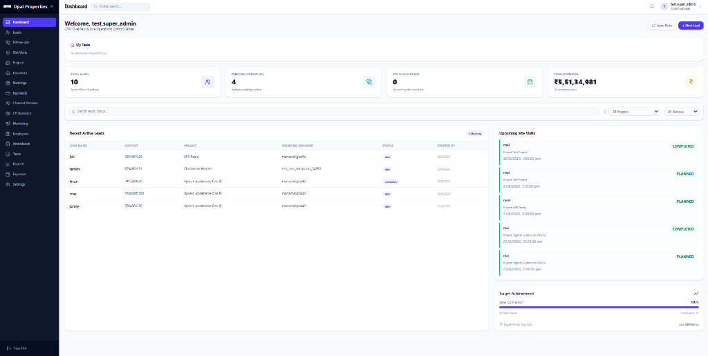

# Opal Properties — Enterprise Real Estate CRM 2.0

[](https://react.dev/)
[](https://www.typescriptlang.org/)
[](https://vitejs.dev/)
[](https://tailwindcss.com/)
[](https://supabase.com/)
[](https://nodejs.org/)

A full-stack, enterprise-grade Customer Relationship Management (CRM) platform designed specifically for real estate developers, agencies, and channel partner networks. Built with high-performance React, TypeScript, TailwindCSS, Supabase (PostgreSQL with Row Level Security), and an automated WhatsApp communication gateway.

---

## 📸 Platform Overview



---

## 🌟 Key Features

### 1. 📊 Executive Operations Dashboard
- **Live Pipeline Metrics**: Total leads, pending follow-ups, scheduled site visits, and converted revenue in real time.
- **Sales Conversion Analytics**: Visual target tracking and team performance insights.
- **Active Task Feed**: Prioritized daily agenda, critical follow-ups, and urgent customer inquiries.
- **Global Search & Filter**: Instant search across leads, channel partners, inventory units, and bookings.

### 2. 👥 Comprehensive Lead Management
- **Lifecycle Tracking**: Monitor leads through New, Contacted, Site Visit Scheduled, Negotiation, and Booked stages.
- **Automated Ownership**: Smart assignment to sales executives and sourcing managers.
- **Channel Partner Attribution**: Seamlessly associate leads with registered Channel Partners (CP) to track referral commissions.
- **Interaction Timeline**: Complete history of calls, notes, site visits, and status changes.

### 3. 🚗 Site Visits & WhatsApp Verification
- **Scheduled Visits**: Calendar scheduling with assigned executives and project destinations.
- **Walk-in Site Visit Pass**: Quick visit logging for walk-in prospects without requiring prior lead entry.
- **Instant Dual-Channel WhatsApp Dispatch**:
  - Automatically sends a secure 6-character verification code to the customer.
  - Automatically notifies the referring Channel Partner simultaneously.
- **Live Outbox Telemetry**: Realtime delivery badge tracking (`Queued` → `Sending` → `Delivered` / `Failed`).

### 4. 🤝 Channel Partner (CP) Network
- **Broker Onboarding & Verification**: Maintain CP profiles, registration numbers, tier ratings, and bank payout details.
- **CP Outreach Engine**: Broadcast new tower launches, payment plan updates, and promotional commission rates.
- **Commission Ledger**: Transparent calculation of referral commissions with invoice approvals and disbursement tracking.

### 5. 🏢 Inventory & Project Management
- **Unit Availability Matrix**: Real-time status mapping across towers and floors (Available, Blocked, Booked, Sold).
- **Project Catalog**: Multiple project configurations, master floor plans, unit specifications, and base prices.
- **Financial Charges Calculator**: Automated calculation of floor rise, parking, clubhouse, GST, and registration fees.

### 6. 📝 Bookings & Financial Milestone Tracking
- **Unit Booking Workflow**: Formal booking agreements with KYC documentation and payment plan selections.
- **Payment Schedules & Milestones**: Construction-linked payment plans (CLP) with milestone due date alerts.
- **Receipts & Ledger**: Payment transaction receipts with audit trails and payment method tracking.

### 7. 💬 Integrated WhatsApp Gateway Microservice
- **Zero Third-Party SMS Costs**: Uses headless Baileys connection to deliver automated notifications directly from your business number.
- **Live QR In-App Pairing**: Scan the QR code directly inside `Settings → WhatsApp Connection` with auto-refreshing heartbeat.
- **Rich Media Marketing**: Broadcast campaigns supporting images, videos, brochures, and price list PDF documents.
- **Intelligent Throttling**: Configurable randomized delays and daily volume caps to protect account health.

### 8. 🛡️ Role-Based Access Control (RBAC) & Security
- Granular permissions for:
  - `super_admin` / `project_admin`
  - `sales_manager` / `sourcing_manager`
  - `sales_executive` / `telecaller`
- Database-enforced PostgreSQL Row Level Security (RLS) ensuring strict tenant and project data isolation.

---

## 🏗️ Architecture & Technology Stack

```
real-estate-crm/
├── src/                          # React + TypeScript Frontend
│   ├── components/               # Reusable UI & Modal components
│   ├── hooks/                    # Auth, realtime notifications, lifecycle hooks
│   ├── layouts/                  # AppLayout, Navigation, Header
│   ├── pages/                    # 20+ specialized CRM business modules
│   ├── services/                 # Supabase client, query logger, attachments
│   └── types/                    # Database schema & TypeScript definitions
├── whatsapp-gateway/             # Node.js Baileys WhatsApp Microservice
│   ├── src/index.js              # Polling worker, HTTP endpoints, Baileys socket
│   └── src/supabaseAuthState.js  # Cloud-persisted session storage
├── docs/screenshots/             # Production UI snapshots
└── supabase/                     # Edge functions and migration scripts
```

- **Frontend**: React 18, TypeScript, Vite, TailwindCSS, Lucide Icons
- **Backend & Database**: Supabase (PostgreSQL 15), Row Level Security (RLS), Realtime Channels, Edge Functions
- **Messaging Gateway**: Node.js, Express, `@whiskeysockets/baileys`, Pino logger
- **Storage**: Supabase Storage Buckets for KYC documents, payment receipts, and marketing attachments

---

## 🚀 Quick Start Guide

### Prerequisites
- [Node.js](https://nodejs.org/) (v18 or higher)
- [npm](https://www.npmjs.com/) or [yarn](https://yarnpkg.com/)
- A [Supabase](https://supabase.com/) project

---

### Step 1: Clone the Repository
```bash
git clone git@github.com:git-nash-init/Real-Estate-CRM-2.0.git
cd Real-Estate-CRM-2.0
```

---

### Step 2: Configure Environment Variables

#### Frontend Configuration (`.env` in root)
Copy `.env.example` to `.env`:
```env
VITE_SUPABASE_URL=https://your-project.supabase.co
VITE_SUPABASE_ANON_KEY=your-supabase-anon-key
```

#### WhatsApp Gateway Configuration (`whatsapp-gateway/.env`)
Create `whatsapp-gateway/.env`:
```env
PORT=3100
SUPABASE_URL=https://your-project.supabase.co
SUPABASE_SERVICE_ROLE_KEY=your-supabase-service-role-key
GATEWAY_API_KEY=your-secure-random-gateway-api-key
WA_DAILY_CAP=200
WA_MIN_GAP_MS=8000
WA_MAX_GAP_MS=15000
```

---

### Step 3: Run the Database Migrations
Execute the SQL migration scripts in your Supabase SQL Editor:
1. `migration_channel_partner_module.sql`
2. `migration_booking_financial_charges.sql`
3. `migration_employees_schema_update.sql`
4. `migration_followup_rls.sql`

---

### Step 4: Install Dependencies & Run

#### Start the CRM Frontend:
```bash
npm install
npm run dev
```
The CRM will be live at `http://localhost:5173`.

#### Start the WhatsApp Gateway Microservice:
```bash
cd whatsapp-gateway
npm install
npm start
```
The Gateway will start listening on port `3100`.

---

## 📱 Connecting WhatsApp

1. Open the CRM at `http://localhost:5173` and log in with an admin account.
2. Navigate to **Settings → WhatsApp Connection**.
3. Scan the displayed QR code using WhatsApp on your phone:
   - Open WhatsApp → **Settings** → **Linked Devices** → **Link a Device**.
4. The panel will update to **Connected** with your phone number.
5. All site visit verification codes and marketing messages will now dispatch automatically.

---

## 🌐 Production Deployment

### 1. Frontend (Vercel / Netlify / Render Static Site)
- **Build Command**: `npm run build`
- **Output Directory**: `dist`
- Set `VITE_SUPABASE_URL` and `VITE_SUPABASE_ANON_KEY` in your hosting dashboard.

### 2. WhatsApp Gateway (Render / Fly.io / VPS)
- Deploy as a long-running Node Web Service.
- Set Root Directory to `whatsapp-gateway`.
- Build Command: `npm install`
- Start Command: `npm start`
- Add `SUPABASE_URL`, `SUPABASE_SERVICE_ROLE_KEY`, and `GATEWAY_API_KEY` to environment variables.
- Configure a free health check ping (e.g., [UptimeRobot](https://uptimerobot.com/)) on `https://your-gateway.onrender.com/status` every 14 minutes to maintain continuous uptime.

---

## 📄 License
This project is proprietary and confidential. Developed for Opal Properties. All rights reserved.
